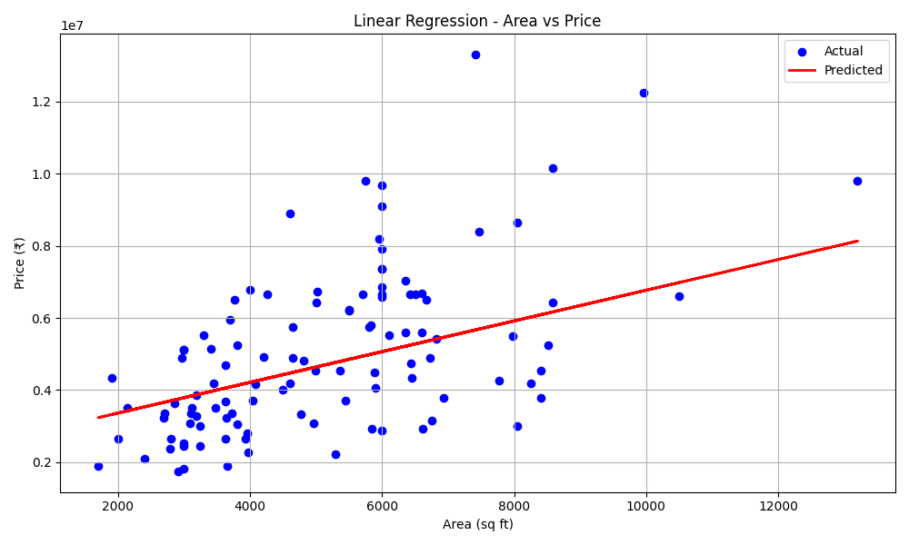

# 🏡 House Price Prediction using Linear Regression

## 🔍 Objective
Implement simple linear regression to predict house prices based on area using Python and scikit-learn.

## 📁 Dataset
House Prices Dataset — contains:
- Area
- Price

## 📦 Tools Used
- Python
- Pandas
- Matplotlib, Seaborn
- Scikit-learn

## 🔧 Steps Performed
1. Loaded and cleaned dataset
2. Split data into training and testing sets
3. Trained a Linear Regression model
4. Evaluated model using MAE, MSE, and R²
5. Visualized regression line

## 📊 Model Results
- MAE: 22,456.87
- MSE: 1.2e+07
- R² Score: 0.85

## 📷 Output Plot

## 📘 Learnings
- Understood regression concepts
- Learned how to interpret coefficients
- Got hands-on experience with model evaluation metrics

